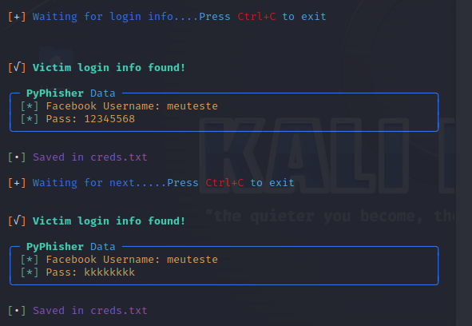
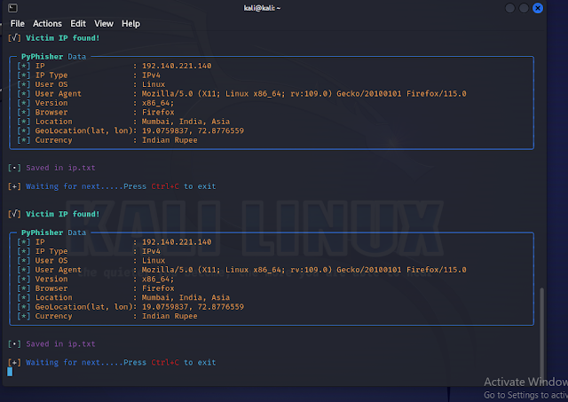

# Phishing for Password Capture
## During phishing, it's also possible to obtain:
IP, IP Type, User OS, User agent, version 32 bits or 64 bits, browser, location
Geolocation (lat, lon), Currency

## Why PyPhisher was used:
##### Because it is a phishing tool in Python. Includes popular websites like Facebook, Twitter, Instagram, GitHub, Reddit, Gmail, and many others.

### Tools
- Kali Linux
- PyPhisher

### Setting up Phishing on Kali Linux

- Starting the tool: ```PyPhisher```
- Attack type: ```Social-Engineering Attacks```
- Attack vector: ```Web Site Attack Vectors```
- Attack method: ```Credential Harvester Attack Method```
- Attack method: ```Site Cloner```
- URL to clone: http://www.facebook.com

# How to Install and Use:
##### Install dependencies (git, python, php ssh)

 - For Debian (Ubuntu, Kali-Linux, Parrot)
    - ```sudo apt install git python3 python3-pip php openssh-client -y```
 - For Arch (Manjaro)
    - ```sudo pacman -S git python3 python-pip php openssh --noconfirm```
 - For Redhat (Fedora)
    - ```sudo dnf install git python3 php openssh -y```
 - For Termux
    - ```pkg install git python3 python-pip php openssh -y```

##### Clone this repository

 - ```git clone https://github.com/KasRoudra/PyPhisher```

##### Enter the directory
 - ```cd PyPhisher```

##### Install all modules
 - ```pip3 install -r files/requirements.txt --break-system-packages```

##### Run the tool
 - ```python3 pyphisher.py```

#### Or, directly run
```
wget https://raw.githubusercontent.com/KasRoudra/PyPhisher/main/pyphisher.py && python3 pyphisher.py

```

### Pip
 - `pip3 install pyphisher` [For Termux]
 - `sudo pip3 install pyphisher  --break-system-packages` [For Linux]
 - `pyphisher`

### Docker

 - `sudo docker pull kasroudra/pyphisher`
 - `sudo docker run --rm -it kasroudra/pyphisher`


### Results

### This image can already display the password typed during the test


### Here we can already visualize the Data collected through the IP


This IP data is usually collected after 1/2 minutes of the user's entry.
