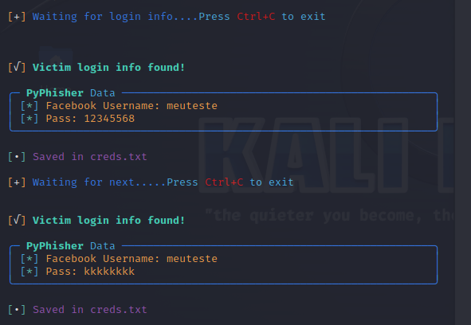
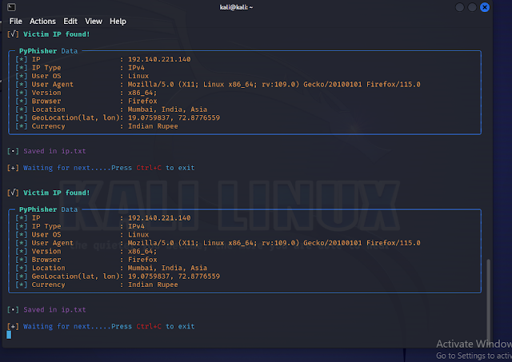

# Phishing para Captura de Senhas
## Durante o phishing, também é possível obter:
IP, Tipo de IP, SO do usuário, Agente do usuário, versão 32 bits ou 64 bits, navegador, localização
Geolocalização (lat, lon), Moeda

## Por que o PyPhisher foi utilizado:
##### Porque é uma ferramenta de phishing em Python. Inclui sites populares como Facebook, Twitter, Instagram, GitHub, Reddit, Gmail e muitos outros.

### Ferramentas
- Kali Linux
- PyPhisher

### Configurando o Phishing no Kali Linux

- Iniciando a ferramenta: ```PyPhisher```
- Tipo de ataque: ```Ataques de Engenharia Social```
- Vetor de ataque: ```Vetores de Ataque a Sites```
- Método de ataque: ```Método de Ataque de Captura de Credenciais```
- Método de ataque: ```Clonagem de Site```
- URL para clonar: http://www.facebook.com

# Como Instalar e Usar:
##### Instale as dependências (git, python, php ssh)

 - Para Debian (Ubuntu, Kali-Linux, Parrot)
    - ```sudo apt install git python3 python3-pip php openssh-client -y```
 - Para Arch (Manjaro)
    - ```sudo pacman -S git python3 python-pip php openssh --noconfirm```
 - Para Redhat (Fedora)
    - ```sudo dnf install git python3 php openssh -y```
 - Para Termux
    - ```pkg install git python3 python-pip php openssh -y```

##### Clone este repositório

 - ```git clone https://github.com/KasRoudra/PyPhisher```

##### Entre no diretório
 - ```cd PyPhisher```

##### Instale todos os módulos
 - ```pip3 install -r files/requirements.txt --break-system-packages```

##### Execute a ferramenta
 - ```python3 pyphisher.py```

#### Ou, execute diretamente
```
wget https://raw.githubusercontent.com/KasRoudra/PyPhisher/main/pyphisher.py && python3 pyphisher.py

```

### Pip
 - `pip3 install pyphisher` [Para Termux]
 - `sudo pip3 install pyphisher  --break-system-packages` [Para Linux]
 - `pyphisher`

### Docker

 - `sudo docker pull kasroudra/pyphisher`
 - `sudo docker run --rm -it kasroudra/pyphisher`

## Uso

1. Execute o script
2. Escolha um site
3. Aguarde um tempo para configurar tudo
4. Envie o link gerado para a vítima
5. Aguarde o login da vítima. Assim que ela fizer o login, as credenciais serão capturadas

<h1 align="center">Exemplo</h1>


## Tutorial em Vídeo
<a href="https://rebrand.ly/pyphishervideo">PyPhisher no Termux</a>
<br/>
<a href="https://youtu.be/xIEuJkmJ8F0">PyPhisher no Kali Linux por InfoSecPat</a>
<br/>
<a href="https://youtu.be/ueF6fNHD8MM">PyPhisher no Kali Linux por Sathvik</a>


### Resultados

### Esta imagem já pode exibir a senha digitada durante o teste


### Aqui já podemos visualizar os dados coletados através do IP


Esses dados de IP normalmente são coletados após 1/2 minutos da entrada do usuário.

# FIM DA PÁGINA...
